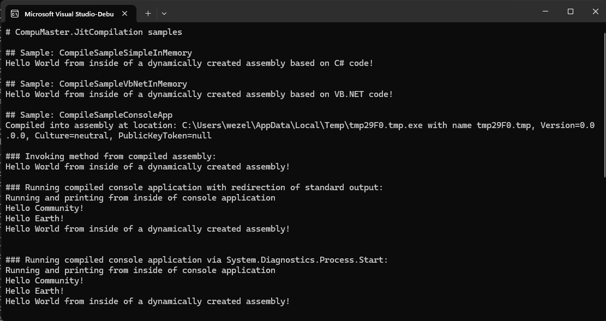

# CompuMaster.JitCompilation

Compile and execute C# or VB.NET code easily on runtime

## C# Samples
```csharp
/// <summary>
/// Simple demonstration of how to compile C# code and running a method from the compiled assembly
/// </summary>
/// <param name="args"></param>
static void CompileSampleSimpleInMemory(string[] args)
{
    string src = "public class TestClass {public static string Answer() {return \"Hello World from inside of a dynamically created assembly!\";}}";
    var cscInMemory = new CompuMaster.JitCompilation.CSharpInMemoryCompiler();
    var cResult = cscInMemory.Compile(src, false);
    System.Console.WriteLine((string)cResult.Invoke("TestClass", "Answer", null)); // result: "Hello World from inside of a dynamically created assembly!"
}

/// <summary>
/// Demonstration of how to compile C# code into an .exe console application assembly and running a method from this assembly by various ways
/// </summary>
/// <param name="args"></param>
static void CompileSampleSimpleToDisk(string[] args)
{
    string src = 
        "public class TestClass {" +
        "   public static void Main(string[] args) {" +
        "       System.Console.WriteLine(\"Running and printing from inside of console application\"); " +
        "       foreach (string greeting in args)" +
        "           System.Console.WriteLine(\"Hello \" + greeting + \"!\"); " +
        "   } " +
        "   public static string Answer() {" +
        "       return \"Hello World from inside of a dynamically created assembly!\";" +
        "   }" +
        "}";
    string tempFilePath = System.IO.Path.GetTempFileName() + ".exe";
    var cscOnDisk = new CompuMaster.JitCompilation.CSharpOnDiskCompiler();
    var cResult = cscOnDisk.Compile(src, Array.Empty<string>(), Array.Empty<string>(), false, tempFilePath, CompuMaster.JitCompilation.Common.TargetType.ConsoleApplication);
    System.Console.WriteLine("Compiled into assembly at location: " + cResult.Assembly.Location + " with name " + cResult.Assembly.FullName);

    System.Console.WriteLine("### Invoking method from compiled assembly:");
    System.Console.WriteLine((string)cResult.Invoke("TestClass", "Answer", null)); // result: "Hello World from inside of a dynamically created assembly!"
            
    System.Console.WriteLine("### Running compiled console application with redirection of standard output:");
    var consoleArgs = new string[] { "Community", "Earth" };
    System.Console.WriteLine(cResult.ExecuteConsoleApp(consoleArgs).StandardOutput);
            
    System.Console.WriteLine("### Running compiled console application via System.Diagnostics.Process.Start:");
    var appProc = System.Diagnostics.Process.Start(new System.Diagnostics.ProcessStartInfo(tempFilePath, string.Join(" ", consoleArgs)) { UseShellExecute = false }); // run compiled console application
    appProc.WaitForExit();
}
```

## Output of C# Samples



```
